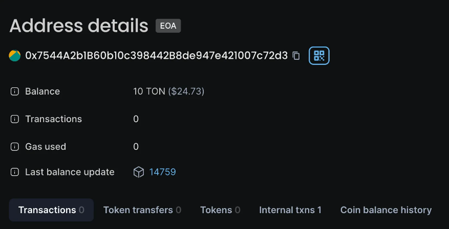

# TON↔WTON

이더스캔(Etherscan)을 이용하여 TON을 wrap 하여 WTON으로 바꾸거나, WTON을 unwap하여 TON으로 바꿀 수 있습니다.&#x20;

1. TON → WTON
   1. Step 1 : Approve&#x20;
      1.  [Approve](https://etherscan.io/address/0x2be5e8c109e2197d077d13a82daead6a9b3433c5#writeContract#F2)를 방문합니다.

          <figure><figcaption>
Etherscan의 approve 영역
</figcaption></figure>

      2. Spender 에 입력할 주소 : [0xc4A11aaf6ea915Ed7Ac194161d2fC9384F15bff2](https://etherscan.io/address/0xc4A11aaf6ea915Ed7Ac194161d2fC9384F15bff2) (고정값, WTON Contract)
      3. Amount : WTON으로의 변환을 허용하고자 하는 최대금액을 입력합니다. (TON의 소숫점은 18자리까지 표시가능 합니다.)
   2. Step 2 : swapFromTON&#x20;
      1.  [swapFromTON](https://etherscan.io/address/0xc4a11aaf6ea915ed7ac194161d2fc9384f15bff2#writeContract#F18)을 방문합니다.

          <figure><figcaption>
이더스캔의 swapFromTON
</figcaption></figure>

      2. tonAmount : WTON으로 변환하고자 하는 TON의 양을 입력하세요 (Step 1에서 승인하신 금액을 초과할 수는 없습니다.)\

2. WTON → TON
   1.  [swapToTON](https://etherscan.io/address/0xc4a11aaf6ea915ed7ac194161d2fc9384f15bff2#writeContract#F20)을 방문합니다.

       <figure><figcaption>
이더스캔의 swapToTON 영역
</figcaption></figure>

   2. wtonAmount : TON으로 변환하고자 하는 WTON의 양을 입력하세요  (WTON의 소숫점은 27자리까지 표시가능 합니다.)
