# How to use the Mini Bridge?

### Introduction

The mini bridge can be configured and integrated into the deployed L2 network. Its key functionality includes Deposit/Withdraw support for ETH, Native token, USDT, and USDC. You can learn more about the mini bridge here. As the code is open source, operators and developers can extend its functionalities to suit their specific needs.

### Quick User guide

After you deploy the mini bridge following the Thanos stack deployment guide, you will get the public domain of that bridge where you can move assets across Layer1 and Layer2.

#### Wallet connect

1. First things first, you can connect your account by clicking `Connect Wallet` button to use the bridge.

<figure>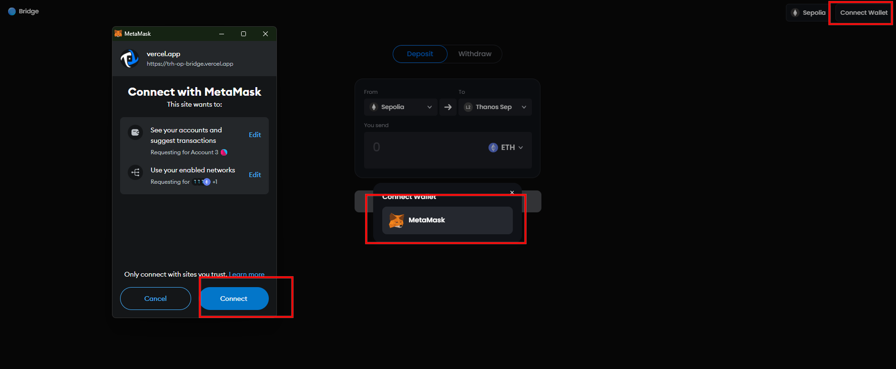<figcaption></figcaption></figure>

2. After you connect your account into the bridge app, you can change the network(L1 & L2) connected and also able to see the token balance of your account.

<figure>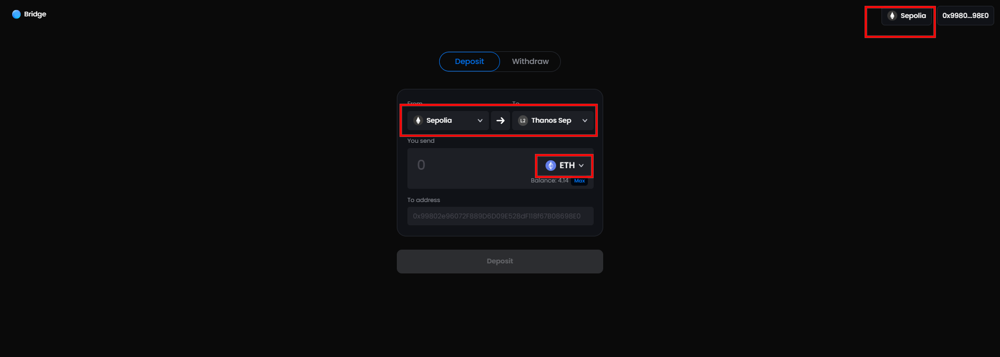<figcaption></figcaption></figure>

<figure>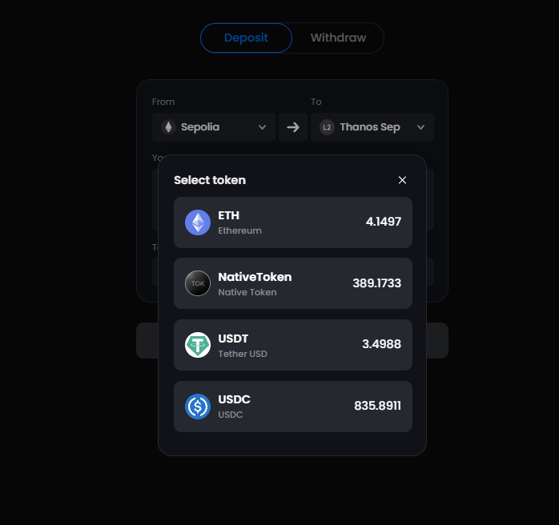<figcaption></figcaption></figure>

#### Deposit(L1 → L2)

1.  Click the `Deposit` tab or set the L1 network chain connected to deposit tokens to the L2 network.

    <figure>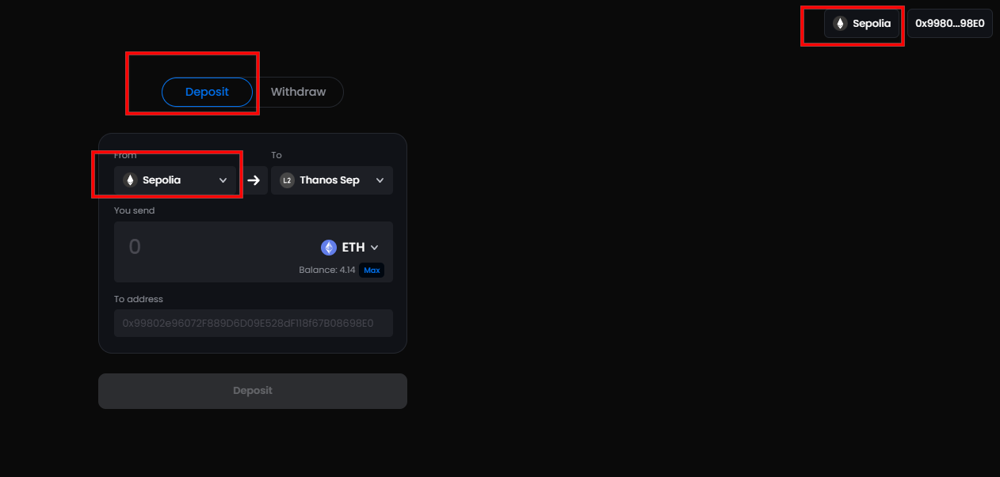<figcaption></figcaption></figure>
2.  Select the token and input the amount to deposit. `To address` is the address to be deposited; it is your current account as a default, but you can put another account if needed. (pic1: connected account, pic2: another account)

    <figure>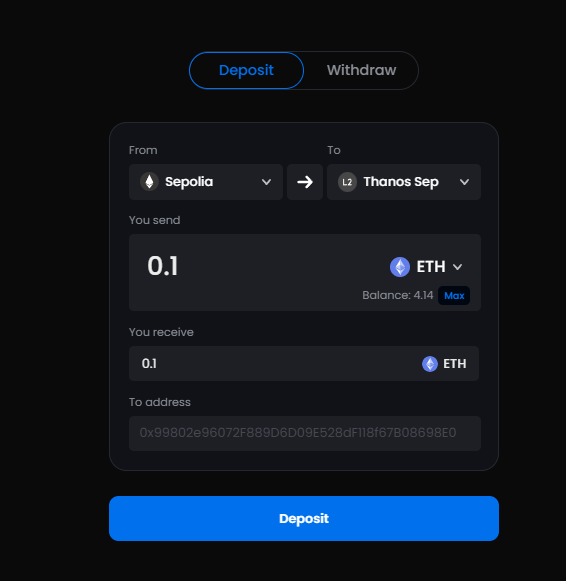<figcaption></figcaption></figure>

<figure>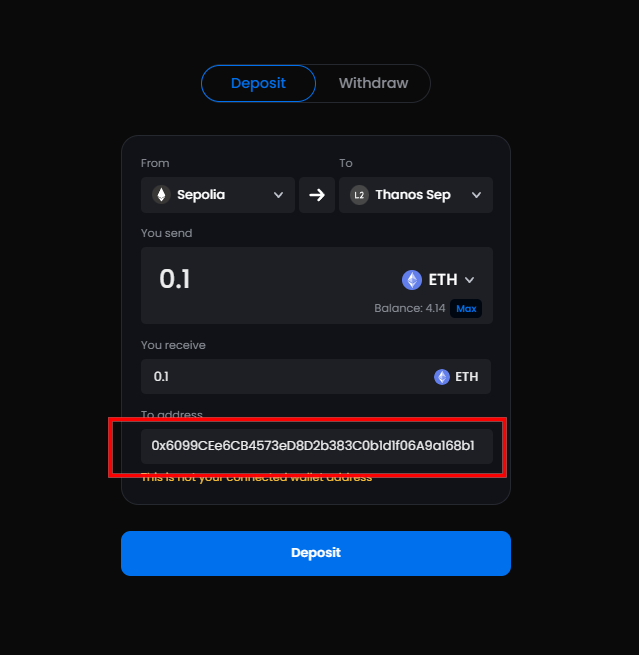<figcaption></figcaption></figure>

3. Click `Deposit` button for ETH deposit and you will need to approve them in case of the other tokens (Native token, USDT, USDC). \
   After the transaction has been confirmed, you will get the link of that transaction.

<figure>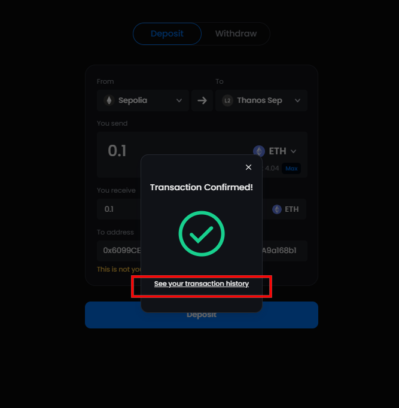<figcaption></figcaption></figure>

#### Withdraw(L2 → L1)

The withdrawal process contains 3 steps (initiate, prove, finalize) based on Optimistic rollup.

1. Initiate
   1.  You can initiate a withdrawal transaction by clicking `Withdaw` → `Initiate` tab and the operations(token selection, input amount, input address to send, etc) are same as what we did for the deposit process.

       <figure>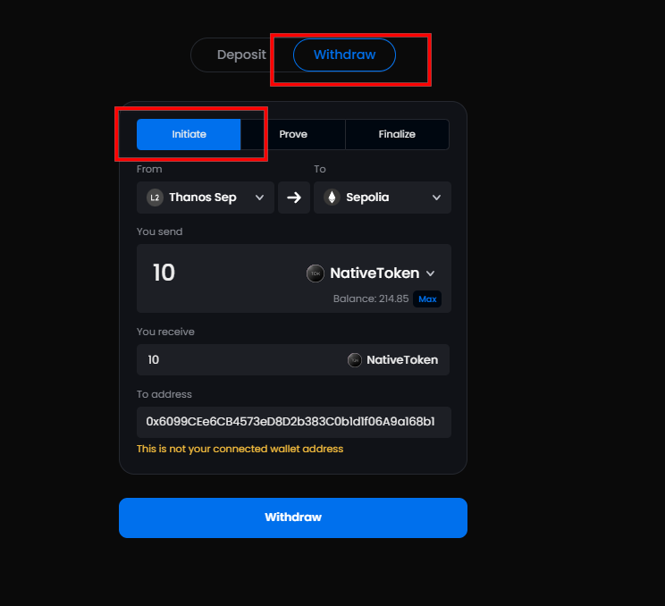<figcaption></figcaption></figure>
   2. After the transaction has been confirmed, you will get the Tx hash which will be used for `prove` and `finalize` process.
2.  Prove

    1. You can check the status of your withdrawal transaction in [Layer2 block explorer](https://explorer.thanos-sepolia.tokamak.network/withdrawals) that you deployed in the previous rollup deployment steps.

    <figure>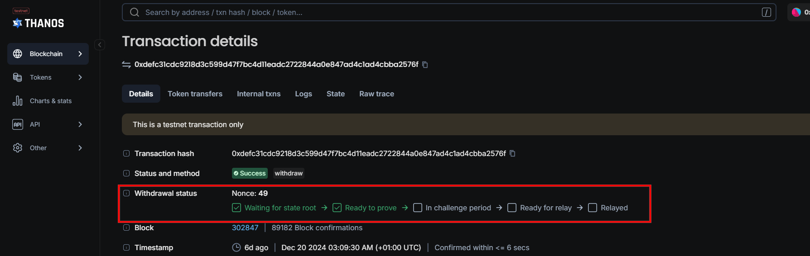<figcaption></figcaption></figure>

    b. Once the transaction is ready to prove, you are ready to prove it. Click `Prove` tab and input the hash of the initiated transaction. Click `Prove` button.

    <figure>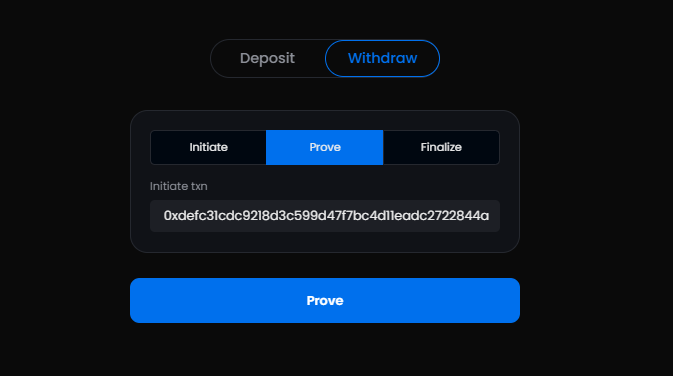<figcaption></figcaption></figure>
3. Finalize
   1. Check the status of your withdrawal transaction in Layer2 block explorer and it should be `Ready for relay` to be finalized.
   2.  Go to `Finalize` tab and input the hash of the initiate transaction. Click `Finalize` button.

       <figure>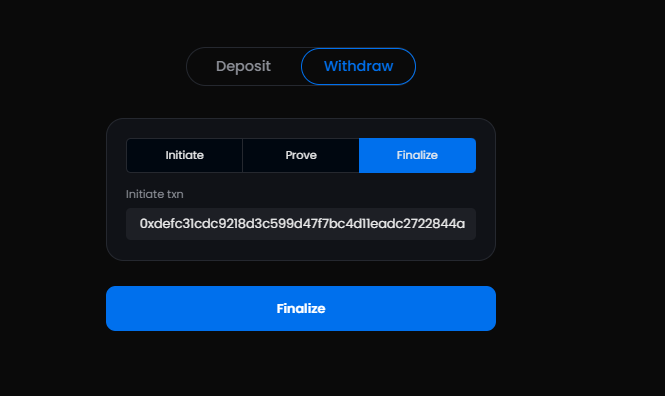<figcaption></figcaption></figure>
