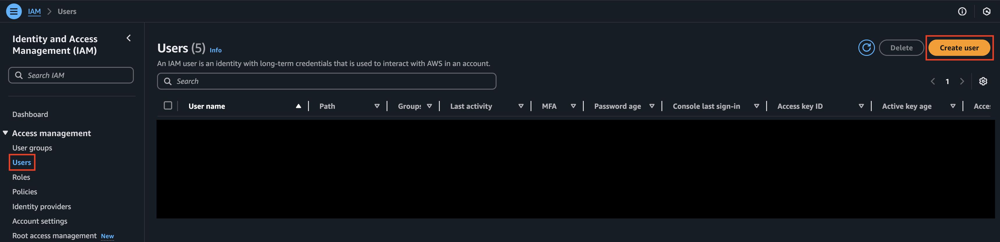
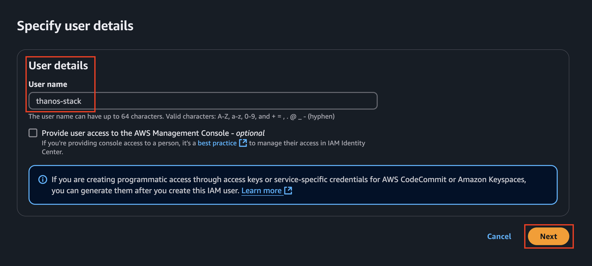
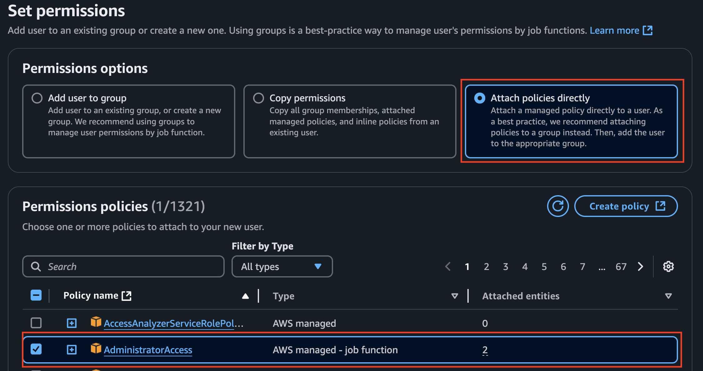
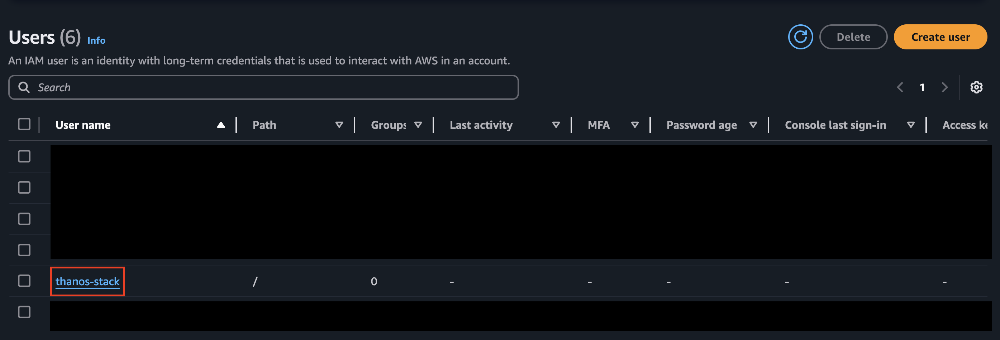
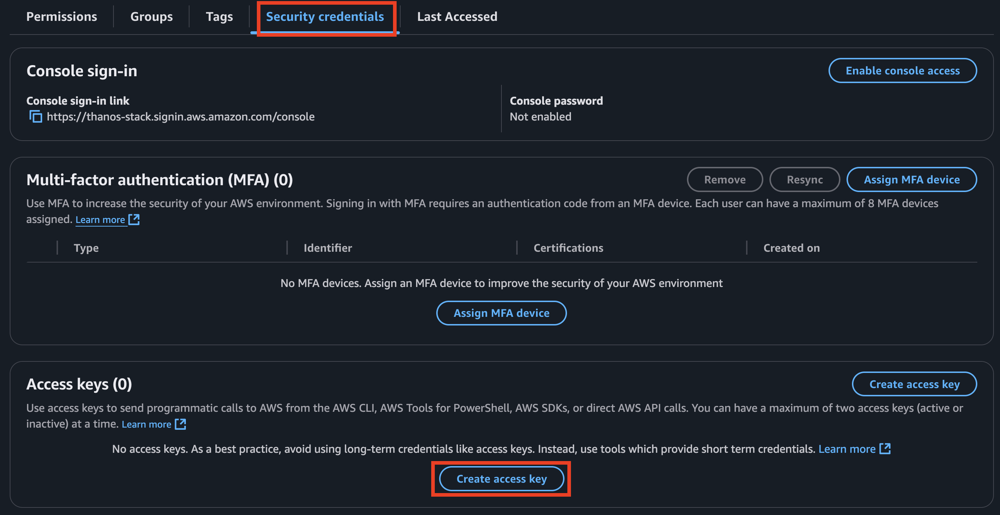
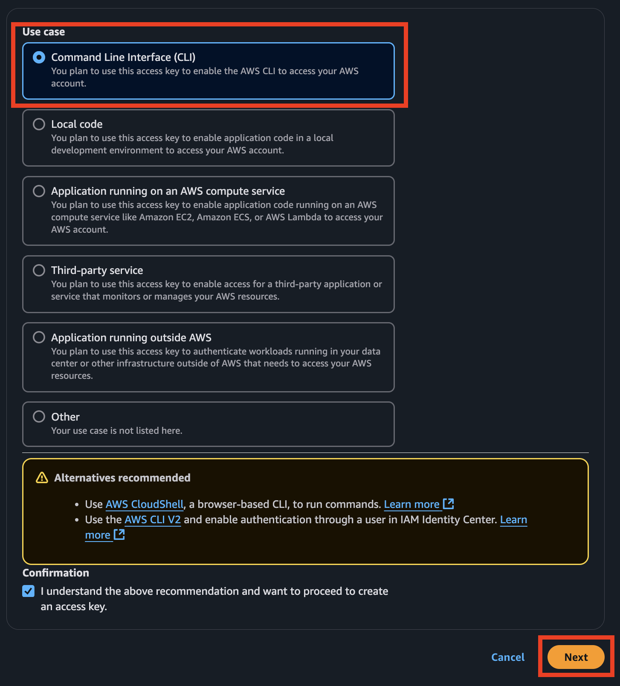
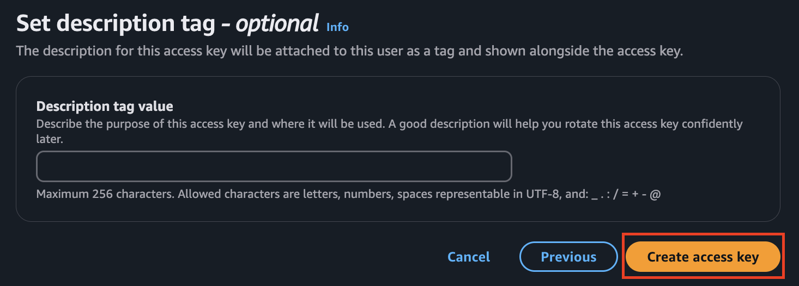
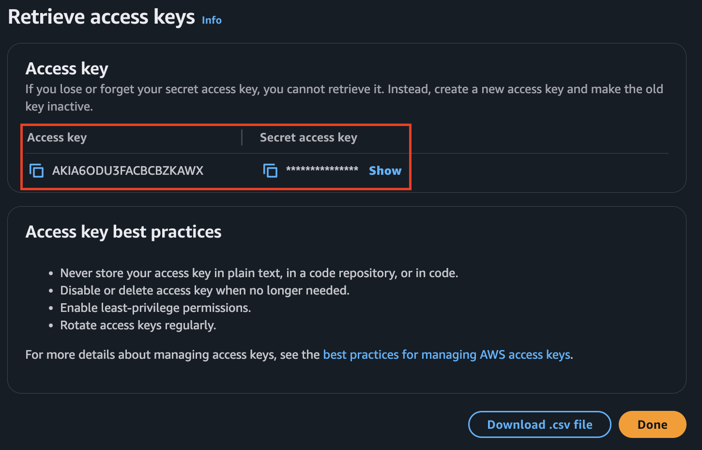

# Prerequisites

The following are the prerequisites you need to ensure before you start deploying the chain.

1. Funding Requirements
2. L1 RPC Endpoint
3. Beacon RPC Endpoint
4. AWS IAM account
5. (Optional) Operators can stake TON to earn seigniorage rewards
6. Tools

Let's go step by step about each of them.

### **1. Funding Requirements**

Funding for multiple EOA accounts is a critical aspect of network setup and operation. These costs can be categorized into deployment costs and post-deployment operational costs.

#### **Operator account**

The operator account plays a crucial role in the operation of the Thanos chain. It is mainly responsible for network upgrades, data availability, and network security.

Below is an explanation of the roles for each account:

* `Admin`: the ability to upgrade contracts.
* `Batcher`: Publish Sequencer transaction data to L1.
* `Proposer`: Publish L2 transaction results (output roots) to L1.
* `Sequencer`: Sign blocks on the p2p network.
* `Challenger`: Resolve dispute game

#### **Deployment Costs**

* **`Admin`** - 0.6 ETH
  * The **admin fee** constitutes the primary deployment expense, covering the deployment of system contracts on L1. This process requires approximately 80,000,000 gas. Assuming a base fee of 7–8 gwei, the estimated cost is approximately **0.6 ETH**.
  * This cost is a one-time expense necessary to establish the foundational infrastructure.
* **`Batcher, Proposer, Challenger`**
  * Post-deployment, **Batcher**, **Proposer**, and **Challenger** accounts incur ongoing operational costs. These expenses are highly variable, depending on the network's configuration and usage patterns.
    * The explanation and process for customizing parameters can be found at: [Chain Configuration](https://docs.tokamak.network/home/~/changes/agYOWEeK7NUEeofss2bX/service-guide/rollup-hub/mainnet/operation-guide/chain-operators/chain-configurations)
    * You can input the desired parameters to calculate the fees in the following spreadsheet: [Thanos Stack Operation Fee Adjustment Spreadsheet](https://docs.google.com/spreadsheets/d/1RmyIg38Kkbf7ZFTG5LEqkBeaBRJ6Ohmsyg_mtZhsmDI/edit?gid=0#gid=0)
* **Sequencer** - Not required.

To ensure smooth operation, users must define an operational funding strategy, including determining the appropriate funding intervals for these accounts. It is recommended to use the provided spreadsheet to estimate operational costs based on the desired network configuration. By doing so, users can allocate sufficient ETH to these accounts to cover anticipated expenses, thereby maintaining seamless network functionality.

### **2. L1 RPC endpoint**

You need an L1 RPC endpoint to handle deposits, withdrawals between L1 and L2 chains, and to ensure data availability and security for the L2 chain.

We currently recommend Alchemy as the L1 RPC endpoint provider. Since Thanos is an Ethereum-based L2 chain, make sure to select Ethereum.

* [Alchemy](https://www.alchemy.com/)

### **3. Beacon RPC endpoint**

To reduce data availability costs by using blobs. You’ll need to set up a Beacon node. You can create an endpoint through Quicknode.

* [Quicknode](https://www.quicknode.com/)

### **4. Set-up AWS account**

Terraform is used to set up an AWS-based infrastructure to deploy the Thanos chain. For Terraform to function properly, it needs to be integrated with your AWS account.

#### Create IAM user

1. In the IAM console, navigate to `Users` and click `Create User`.

<figure><figcaption></figcaption></figure>

2. Enter the User name and click the `Next` button.

<figure><figcaption></figcaption></figure>

3. To select the `Attach policies directly` option and proceed with the deployment, you need most of the permissions for AWS resources, so select `AdministratorAccess`.

<figure><figcaption></figcaption></figure>

4. Click the `Next` button, then click the `Create user` button to create the user.
5. On the user screen, click on the newly created user.

<figure><figcaption></figcaption></figure>

6. In the `Security credentials` tab, click `Create access key`.

<figure><figcaption></figcaption></figure>

7. Select `Command Line Interface` as the use case and click `Next`.

<figure><figcaption></figcaption></figure>

8. Click on `Create access key` .

<figure><figcaption></figcaption></figure>

9. Copy and store the `Access key` and `Secret access key`.

<figure><figcaption></figcaption></figure>


Copy and securely store the Access key and Secret access key for later use. Ensure they are not exposed to unauthorized access


10. Configure the settings using the AWS command.

```bash
$ aws configure
AWS Access Key ID [****************G3HD]: [ Input your Access Key ID ]
AWS Secret Access Key [****************2suN]: [ Input your Secret Access Key ]
Default region name [ap-northeast-2]: ap-northeast-2
Default output format [json]: json
```

11. Use the following command to verify that the registration was successful.

```bash
$ aws sts get-caller-identity
{
    "UserId": "AIDA6ODU3FACNHKZTMP2I",
    "Account": "992382494724",
    "Arn": "arn:aws:iam::992382494724:user/thanos-stack"
}
```

Once the setup is complete, proceed to the next phase

### **5. Stake TON as an Operator**

As detailed in our [whitepaper](https://github.com/tokamak-network/papers/blob/master/cryptoeconomics/tokamak-cryptoeconomics-en.md#221-ton-staking-v1), operators launching a new chain must **deposit TON as collateral (optional for now)** which is used for challenge mechanism and opportunity for operator to earn **seigniorage rewards**.

In the current Thanos Beta release, the operator registration mechanism for TON staking is not yet integrated.

This feature will be introduced in **Staking v2.5**, which is currently **undergoing audit**. However, operators who wish to explore staking early can use **Staking v1** to stake TON and earn seigniorage rewards.

**Note:** TON staked in **Staking v1 cannot be migrated** to Staking v2.5 for operator registration.

🔗 **More details:** [Whitepaper link](https://github.com/tokamak-network/papers/blob/master/cryptoeconomics/tokamak-cryptoeconomics-en.md#221-ton-staking-v1)

🔗 **Try Staking v1:** [Staking v1 link](https://simple.staking.tokamak.network/home)

🔗 **Staking v1 Guide:** [Guide](https://docs.tokamak.network/home/service-guide/staking-and-dao/simple-staking)

### 6. Tools

To use the Thanos stack, you will need the following tools:

| Tool                                                                                     | Version |
| ---------------------------------------------------------------------------------------- | ------- |
| [git](https://git-scm.com/downloads)                                                     | `^2`    |
| [go](https://go.dev/doc/install)                                                         | `^1.21` |
| [node](https://nodejs.org/en/download)                                                   | `^20`   |
| [pnpm](https://pnpm.io/next/cli/install)                                                 | `^8`    |
| [foundry](https://book.getfoundry.sh/getting-started/installation)                       | `0.2.0` |
| [make](https://linux.die.net/man/1/make)                                                 | `^3`    |
| [jq](https://github.com/jqlang/jq)                                                       | `^1.6`  |
| [direnv](https://direnv.net/)                                                            | `^2`    |
| [aws-cli](https://docs.aws.amazon.com/cli/latest/userguide/getting-started-install.html) | `^2.1`  |
| [terraform](https://developer.hashicorp.com/terraform/install)                           | `^1.9`  |
| [kubectl](https://pwittrock.github.io/docs/tasks/tools/install-kubectl/)                 | `^1.28` |
| [helm](https://helm.sh/docs/intro/install/)                                              | `^3`    |

