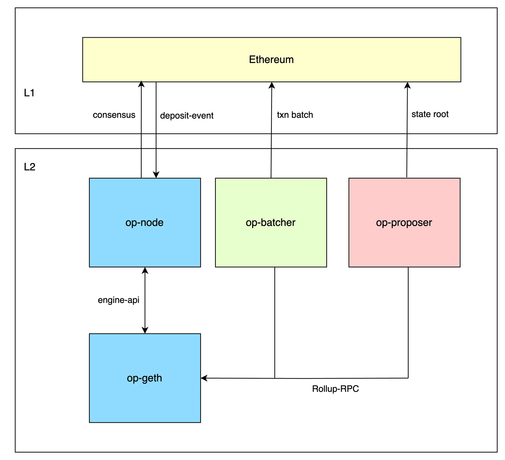

# Architecture

### Intro

This page provides information on how the various components of Thanos Stack interact to build an on-demand L2 blockchain system. It conceptually explains each component and introduces the important roles they play within the system, aiming to provide a deeper understanding of how the entire system operates efficiently.

### Overview

The Thanos Stack comprises the following fundamental modules: op-node, op-proposer, op-geth, op-batcher.

The diagram below illustrates how the core components: op-node, op-proposer, op-geth, op-batcher interact:

<figure><figcaption></figcaption></figure>

### Components

#### op-node

The [`op-node`](https://github.com/tokamak-network/tokamak-thanos/tree/main/op-node) functions as the consensus layer for L2, handling the building, relaying, and verification of blocks using data from L1. It determines how transactions are added to blocks, which blocks are included in the L2 chain, and which blocks are finalized through the Engine API, similar to L1.

The key responsibilities of op-node include

* Listening for deposit events on the L2.
* Building unsafe blocks that include deposit events and transactions from the L2 mempool.
* Fetching batch data posted by op-batcher to identify which blocks are safe.
* Finalizing L2 blocks based on finalized blocks from L1.

#### op-proposer

The [`op-proposer`](https://github.com/tokamak-network/tokamak-thanos/tree/main/op-proposer) is a lightweight service responsible for automating the submission of output-root proposals to L1 at regular intervals, forming a key part of the Fault Dispute Games. It handles chains with pre-Fault-Proof deployments by submitting proposals to the **OptimismPortal**, and for Fault-Proof-enabled chains, it interacts with the **DisputeGameFactory** to instantiate and resolve fault-proof games. Once an output root is validated, it enables users to finalize withdrawal messages associated with that root, authenticating withdrawals by registering proof of inclusion in the L2 withdrawal contract storage. This process facilitates L2-to-L1 messaging and provides L1 with an accurate view of the L2 state.

#### op-geth

The [`op-geth`](https://github.com/tokamak-network/tokamak-thanos/blob/main/op-e2e/op_geth.go) acts as the execution layer for the L2, where transactions are executed, and blocks are constructed. It receives block decisions from the op-node to determine which blocks should be added or finalized. Since op-geth is a stateful service, operators must exercise caution when handling unexpected shutdowns to avoid issues with state integrity.

#### op-batcher

The [`op-batcher`](https://github.com/tokamak-network/tokamak-thanos/tree/main/op-batcher) is a service responsible for submitting L2 block data to L1 to ensure data availability for verifiers while minimizing costs. It bundles and compresses L2 transactions before posting them to L1, using blob transactions in the Thanos stack for gas efficiency. Working in conjunction with the sequencer, the data availability layer, and the pipeline, the op-batcher supports the progression of the safe chain by optimizing data submission and maintaining availability.
