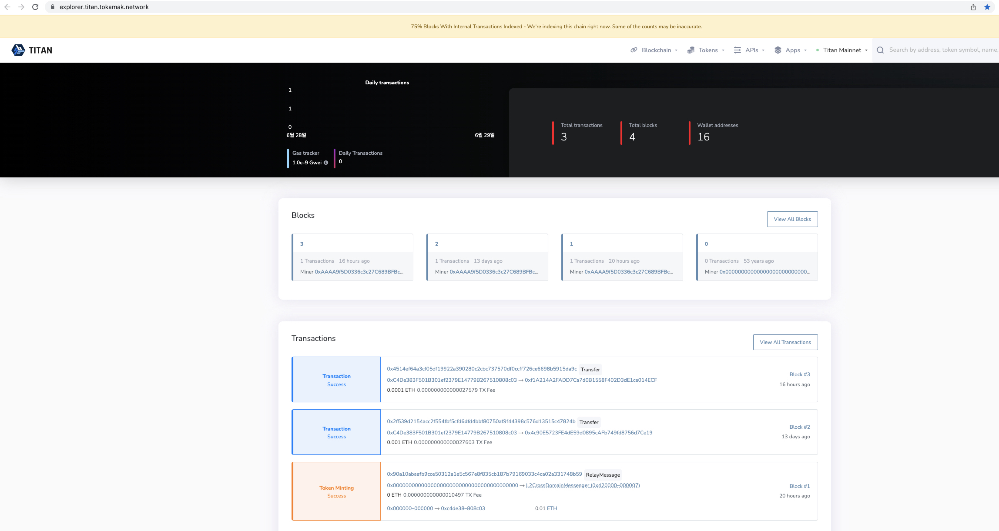

# Add Titan on Metamask

본 가이드에서는 MetaMask에서 Titan 네트워크를 추가하는 방법을 설명합니다. MetaMask 설치 방법과 MetaMask에서 Titan 네트워크를 추가하는 법 두 가지를 안내해드리겠습니다.

웹 브라우저는 Chrome을 기준으로 설명드리겠습니다.

### Chrome에서 MetaMask를 설치하는 법

<figure><figcaption></figcaption></figure>

1. Chrome으로 [https://www.google.com/ ](https://www.google.com/%EC%97%90)후 로그인
2. 로그인 후 위 스크린샷과 같이 오른쪽 상단의 버튼 클릭
3. 확장프로그램 클릭
4. Chrome 웹 스토어 방문하기 클릭

<figure><figcaption></figcaption></figure>

* 위의 과정을 실행하고 나면 Chrome 웹스토어 창이 뜨게 됩니다. 이 화면에서 스토어 검색을 클릭 후 MetaMask를 검색합니다.

<figure><figcaption></figcaption></figure>

* MetaMask를 검색하시면 위와 같은 화면이 나오게 됩니다. 여기서 MetaMask를 클릭합니다.

<figure><figcaption></figcaption></figure>

* MetaMask를 클릭하시면 위와 같은 화면이 나오게 됩니다. 여기서 Chrome에 추가를 클릭하시면 됩니다.

<figure><figcaption></figcaption></figure>

* 제대로 MetaMask가 설치되었다면 위와 같이 'Chrome에 추가' 버튼이 'Chrome에서 삭제'로 변경된 것을 확인하실 수 있습니다.

<figure><figcaption></figcaption></figure>

1. MetaMask 설치 후 스크린샷과 같이 오른쪽 상단의 버튼 클릭
2. 확장프로그램 클릭
3. 확장 프로그램 관리 클릭

<figure><figcaption></figcaption></figure>

* 위 스크린샷과 같이 확장 프로그램 관리 창이 나오게 되는데 여기서 MetaMask쪽에 빨간색 박스와 같이 되어있으면 설치가 완료된 것입니다.

### MetaMask에서 Titan 네트워크를 추가하는 법 1

<figure><figcaption></figcaption></figure>

* [https://explorer.titan.tokamak.network](https://explorer.titan.tokamak.network)를 접속하시면 상단의 화면이 나옵니다. 화면에서 스크롤을 내려줍니다.

<figure><figcaption></figcaption></figure>

* 스크롤을 내려주시면 하단에 빨간색 박스처럼 MetaMask 아이콘과 "Add Titan Mainnet" 문구가 있는데, 이 문구를 클릭해줍니다.

<figure><figcaption></figcaption></figure>

* 클릭하면 다음과 같이 메타마스크 팝업이 열립니다. 여기서 스크롤을 내려줍니다.

<figure><figcaption></figcaption></figure>

* 스크롤을 내려주시면 다음과 같이 승인버튼이 보이는데 승인 버튼을 눌러줍니다.

<figure><figcaption></figcaption></figure>

* 승인버튼을 누르고나면 다음과 같은 화면이 나옵니다. 화면에서 네트워크 전환 버튼을 클릭합니다.

<figure><figcaption></figcaption></figure>

* 네트워크 전환버튼을 클릭하면 다음과 같이 Titan Mainnet 네트워크가 추가된 것을 확인하실 수 있습니다.

### MetaMask에서 Titan 네트워크를 추가하는 법 2

<figure><figcaption></figcaption></figure>

* 앞서 설치한 메타마스크 아이콘을 클릭해줍니다. 그 후 이더리움 메인넷을 클릭합니다.

<figure><figcaption></figcaption></figure>

* 이더리움 메인넷을 클릭하면 다음과 같은 화면이 나옵니다. 네트워크 추가 버튼을 클릭합니다.

<figure><figcaption></figcaption></figure>

* 네트워크 추가 버튼을 클릭하면 다음과 같은 화면이 나옵니다. 다음 화면에서 네트워크 수동 추가를 클릭합니다.

<figure><figcaption></figcaption></figure>

* 네트워크 수동 추가를 클릭하면 다음과 같은 화면이 나옵니다.

1. 네트워크 이름 : Titan
2. 새 RPC URL : [https://rpc.titan.tokamak.network](https://rpc.titan.tokamak.network)
3. 체인 ID : 55004
4. 통화 기호 : ETH
5. 블록 탐색기 URL (옵션) : [https://explorer.titan.tokamak.network](https://explorer.titan.tokamak.network)

을 입력합니다.

<figure><figcaption></figcaption></figure>

* 해당 상태에서 저장을 클릭합니다.

<figure><figcaption></figcaption></figure>

* 저장이 끝나면 다음과 같이 Titan 네트워크가 추가 된 것을 확인하실 수 있습니다.
