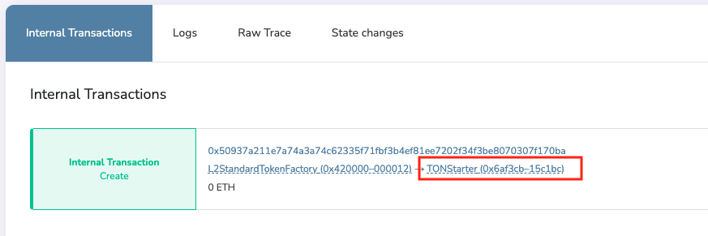

# How to create a standard ERC20 token in L2

L1과 연동되는 L2의 ERC20 토큰 만드는 방법을 설명하려고 합니다. 표준 ERC20 토큰을 만드는 법과 맞춤형 ERC20 토큰을 만드는 법 두가지를 설명드리겠습니다.

### 표준 ERC20 토큰을 만드는 법

* 사용자는`L2StandardTokenFactory` 컨트랙트를 이용해서 편리하게 ERC20 토큰을 만들수 있습니다.

```
L2StandardTokenFactory 주소 : 0x4200000000000000000000000000000000000012
```

* Titan 블록 익스플로러를 이용하여, `L2StandardTokenFactory` 컨트랙트 페이지로 이동합니다. ([Titan](https://explorer.titan.tokamak.network/address/0x4200000000000000000000000000000000000012) / [Titan Sepolia](https://explorer.titan-sepolia.tokamak.network/address/0x4200000000000000000000000000000000000012/write-contract#address-tabs))
* 아래와 같이 화면 중간에 Write Contract 탭을 확인하실 수 있습니다.

<figure><figcaption></figcaption></figure>

1. Connect wallet 버튼을 클릭하여, wallet 연결을 합니다.
2. 1번 `createStandardL2Token` 함수를 이용합니다. 아래 입력박스에 각 요소를 입력하고, Write 버튼을 클릭합니다.
   * `_L1Token(address)`: 브릿지를 통해 연결될 L1 토큰의 주소
   * `_name(string)`: 토큰 이름
   * `_symbols(string)`: 토큰 심볼
3. &#x20;위의 2.을 통해 실행한 트랜잭션의 이벤트를 통해 L2토큰 주소를 확인할 수 있습니다.


* `L2StandardTokenFactory` 컨트랙트 페이지의 중간에 Transactions 탭에서 전송된 트랜잭션을 확인 할 수 있습니다.

<figure><figcaption></figcaption></figure>

* 해당 트랜잭션을 클릭하면 트랜잭션 내용 페이지로 이동하면 트랜잭션 상세 정보를 확인할 수 있습니다.

<figure><figcaption></figcaption></figure>

* 트랜잭션 페이지의 중간에 입력한 값을 확인할 수 있습니다. 아래 그림과 같이 입력한 내용이 확인 됩니다.

<figure><figcaption></figcaption></figure>

* 그리고 바로 아래 Internal Transactions 탭이 보입니다. 아래 그림에서 빨간 박스 부분이 만들어진 `L2Token` 입니다. 아래 화면은 이름이 표시되어 있지만 여러분의 경우는 주소로 보일 수 있습니다.

<figure><figcaption></figcaption></figure>

* 그럼 위에서 보이는 L2토큰을 verify 하는 방법을 알려드리겠습니다. 이부분은 하지 않으셔도 무관합니다.
* 이 방법은 hardhat 사용 지식이 있는 분들을 대상으로 합니다. (만약 hardhat 사용경험이 없으신 분들은 아래 브릿지 토큰 등록시 verify 요청란에 체크하시면 팀에서 verify 합니다.)
* 위의 코드는 [https://github.com/tokamak-network/tokamak-titan/tree/L2Token\_verify/packages/contracts](https://github.com/tokamak-network/tokamak-titan/tree/L2Token\_verify/packages/contracts) 에 있습니다.
* 다음과 같이 실행하시면 verify가 됩니다.

```bash
npx hardhat verify {L2Token주소}  0x4200000000000000000000000000000000000010 {L1Token주소} {name} {symbol} --network titan 
```

* L2토큰을 만드신 후에 [브릿지](https://bridge.tokamak.network/)에 등록을 해야합니다. [토큰 등록폼](https://forms.gle/actJrRuAtHT7ycG5A)에서 토큰 정보를 기입하고 제출해주세요. 팀에서 확인후 브릿지에 등록하고 결과를 알려드립니다.

### 맞춤형 ERC20 토큰을 만드는 법

* `L2StandardTokenFactory`을 이용하면, L1과 연결된 `decimals` 18인 표준 ERC20을 만들수 있습니다. 하지만 L1 토큰의 decimal이 18이 아니라면 `L2StandardTokenFactory`을 이용하실 수 없습니다.
* 이런 경우 `L2StandardERC20`을 상속 받아서, 필요한 함수를 추가하여 컨트랙트를 만드실 수 있습니다.

```bash
mkdir createCustomToken
cd $_
npm install hardhat@2.9.6 --save-dev
npx hardhat init
npm install @tokamak-network/titan-contracts @openzeppelin/contracts @nomiclabs/hardhat-etherscan@^3.1.5 --save

// hardhat.config.ts 혹은 hardhat.config.js 버전을 0.8.9 이상으로 수정해주세요. 
```


* 하드햇 기본 설정 파일 예제입니다. `hardhat.config.ts`

```tsx
import * as dotenv from "dotenv";

import { HardhatUserConfig, task } from "hardhat/config";
import "@nomiclabs/hardhat-etherscan";
import "@nomiclabs/hardhat-waffle";
import "@typechain/hardhat";
import "hardhat-gas-reporter";
import "solidity-coverage";

dotenv.config();

// This is a sample Hardhat task. To learn how to create your own go to
// <https://hardhat.org/guides/create-task.html>
task("accounts", "Prints the list of accounts", async (taskArgs, hre) => {
  const accounts = await hre.ethers.getSigners();

  for (const account of accounts) {
    console.log(account.address);
  }
});

// You need to export an object to set up your config
// Go to <https://hardhat.org/config/> to learn more

const config: HardhatUserConfig = {
  solidity: "0.8.9", 
	networks: {
    titan: {
      url: `${process.env.ETH_NODE_URI_TITAN}`,
      accounts: [`${process.env.PRIVATE_KEY}`],
      chainId: 55004 
    },
    titangoerli: {
      url: `${process.env.ETH_NODE_URI_TITAN_GOERLI}`,
      accounts: [`${process.env.PRIVATE_KEY}`],
      chainId: 5050 
    }, 
  },
  gasReporter: {
    enabled: process.env.REPORT_GAS !== undefined,
    currency: "USD",
  },
  etherscan: {
		apiKey: { 
      "titangoerli": "verify",
      "titan": "verify"
    } ,
    customChains: [
      {
        network: "titangoerli",
        chainId: 5050,
        urls: {
          apiURL: "<https://goerli.explorer.tokamak.network/api>",
          browserURL: "<https://goerli.explorer.tokamak.network>"
        }
      },
      {
        network: "titan",
        chainId: 55004,
        urls: {
          apiURL: "<https://explorer.titan.tokamak.network/api>",
          browserURL: "<https://explorer.titan.tokamak.network>"
        }
      }
    ] 
  },
};

export default config;
```


* 커스텀 ERC20 (`L2CustomERC20`) 컨트랙트 예제 코드입니다. `contracts/L2CustomERC20.sol`

```solidity
// SPDX-License-Identifier: MIT
pragma solidity >=0.5.16 <0.9.0;

import { L2StandardERC20 } from "@tokamak-network/titan-contracts/standards/L2StandardERC20.sol";

contract L2CustomERC20 is L2StandardERC20 {
    constructor(
	      address _l1Token,
	      string memory _name,
	      string memory _symbol
    ) L2StandardERC20(0x4200000000000000000000000000000000000010, _l1Token, _name, _symbol){

	}

    function decimals() public pure override returns (uint8) {
	        return 6;
    }
}
```


* 위에서 작성한 `L2CustomERC20` 컨트랙트를 배포하는 샘플 스크립트입니다. `scripts/deploy.ts`

```tsx
import { ethers } from "hardhat";

async function main() {
  const L1TokenAddress = "0x07865c6e87b9f70255377e024ace6630c1eaa37f";
  const TokenName = "USDC Sample";
  const TokenSymbol = "USDC";

  // We get the contract to deploy
  const L2CustomERC20Factory = await ethers.getContractFactory("L2CustomERC20");
  const L2CustomERC20 = await L2CustomERC20Factory.deploy(
    L1TokenAddress,
    TokenName,
    TokenSymbol
  );

  await L2CustomERC20.deployed();

  console.log("L2CustomERC20 deployed to:", L2CustomERC20.address);
}

// We recommend this pattern to be able to use async/await everywhere
// and properly handle errors.
main().catch((error) => {
  console.error(error);
  process.exitCode = 1;
});
```


* 컴파일, 배포 및 verify는 아래와 같이 하실 수 있습니다.

```bash
// 컴파일 
npx hardhat compile 

// 베포
npx hardhat run ./scripts/deploy.ts --network titan 

// verify
npx hardhat verify {L2Token주소} {L1Token주소} {name} {symbol} --network titan  
```


L2토큰을 만드신 후에 [브릿지](https://bridge.tokamak.network/)에 등록을 해야합니다. [토큰 등록폼](https://forms.gle/actJrRuAtHT7ycG5A)에 토큰 정보를 기입하고 제출해주세요. 팀에서 확인후 브릿지에 등록하고 결과를 알려드립니다.


